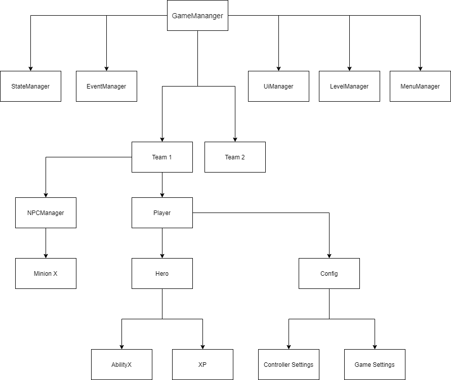

# Mini-MOBA: Spieleprogrammierung 2021 Semester Project

Gruppenprojekt Sommersemester 2021. MOBA-Minispiel.

## Introduction

Mini MOBA-Game developed by Daniela & Sebastian. More game specifics below.

We tried to touch all aspects of game development, yet had some emphasis on certain aspects, which were aligned with our subjective points of interest:

1. Completeness of the game
2. Robust Engineering
3. Intuitive and smooth user experience

## The Game

AlienMOBA provides the following features:

- A single lane MOBA experience
- A player hero with 4 abilities (each with completely different effects/mechanics/visuals)
- No enemy hero
- NPCs & automatic creep waves
- Battle mechanic for all NPCs (including towers)
- XP & Leveling System
- Animated and behaviour-adapted models
- Pause & Settings Menu

The player gets so roam around the map with the goal to destroy the enemy core. 15 seconds after the match starts the first creep waves will spawn.
From there on out, every 30 seconds, further waves will spawn. The player can defeat the enemy creeps and buildings by using the provided spells or by using basic / auto attacks.
The first ability provides a damage buff that increases the damage of all other spells for a limited amount of time. The second spell is a placeable AOE that damages enemies standing in it.
The third ability is a charge that damages enemy units that come in contact with the player during his charge. The 4th spell is the ultimate which is unlocked at level 5.
It is a strong AOE spell that rapidly does damage to all enemy units around the player for a limited amount of time. Experience is awarded for defeating enemy units (creeps and buildings).
Due to the small group size and the limited amount of time, no enemy AI was implemented as a counterpart to the player hero. Instead, the game provides the option to spawn stronger enemy creeps.
These creeps have more health and do increased damage in comparison to the default creeps. The ability to spawn these buffed creeps can be toggled on and off in the exit menu during the match (esc).
If buffed enemy creeps are toggled and the player does not interact with the game / does not fight the creeps, the player will automatically lose within three minutes.

## Usage

The `build/` directory contains the games final executable. Check it out an run it.

In case the executable will not start, run it with administrative priviliges.

## Work Distribution

Distribution was kinda asymetrically, given a larger chunk of work was provided by Daniela (it's hard to keep up).

- Level Design: Daniela
- Models & Animations & Prefabs: Daniela
- Sound & SFX: Daniela
- UI: Daniela / Sebastian
- Player Mechanics: Sebastian / Daniela
- Game Mechanics: Daniela / Sebastian
- Menu: Daniela
- SW Engineering: Sebastian / Daniela
- SW Architecture: Sebastian

## Software Architecture

The major objective for developing a robust software architecture was the ability to propagate state dynamically. Unity allows for hard-wiring scripts and states via the engine's game editor, yet this only satiesfies the demands to a certain complexitiy threshold. It definitely doesn't allow dynamic linking and discovery (what will inevitale be required for any growing project which doesn't want to waste tons of hours for hard-coupling entities).

Below diagram gives a quick outlook for a abstract architecture. This is the intended system; it is only partially converted (time limitation, c# f\*tastics).



## Assets

Asset Structure:

```bash
Abilities
Animations/
Materials/
Models/
Prefabs/
Scenes/
Scripts/
    |-- Behaviour/
    |-- Global/
    |-- Heroes/
    |-- HeroAbilities/
    |-- Menu/
    |-- Player/
    |-- Sound/
    |-- Teams/
    |-- UI/
    |-- Utility/
Sounds/
Textures/
UI/
```

## State

As previously mentioned, an important part of a dynamic system is the easy access and propagation of a distributed system's state (tons of controllers talking to each other is actually distributed). This means explicit state management & and event broadcasting. Unfortunately 'c#'/'unity' gives one a hard time implementing a robust & easy implementation of those (say: absence of: object composition? chaining? multi inherence? sophisticated type inference? interface checks? ... even generics work very shallow/complicated with unity; but that's just some rant from a non-c#-dev). Anyways, the current state implementation basically is a deeply nested dynamic dictionary with some top-level get/set properties on top of it (far from a good solution; but there wasn't enough time left to research/reimplement). Below gives an example of the state's nesting structure:

```bash
# GameMananger instantiates StateManager
gm.state = new GameMananger()

# Level State
gm.state.game = {
    time: x,
    isPaused: x,
    team1Kills: x,
    team1NexusHp: x,
}

gm.state.config = {
    hotkeyAbility1: x,
    cameraSpeed: x,
    volume: x
}
# Player State
gm.state.team1.heroes.player1 = {
    maxLife: x,
    currentLife: x,
    maxMana: x,
    currentMana: x,
    currentLevel: x,
    currentXp: x,
    nextLevelXp: x,
    buffs: []
    debuffs: []
    abilities: {
        ability1: {
            castType: x,
            damageType: x,
            range: x,
            isActive: x,
            defaultCoolDown: x,
            cooldownRemaining: x,
        }
    }
}
```

## External Resources

- [Ability Sprites](https://www.pngegg.com/)
- [Ability Icons](https://opengameart.org/)

## Authors

- Daniela Rudzanová
- Sebastian Winkler
